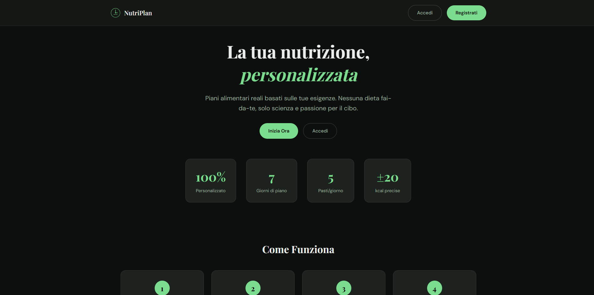
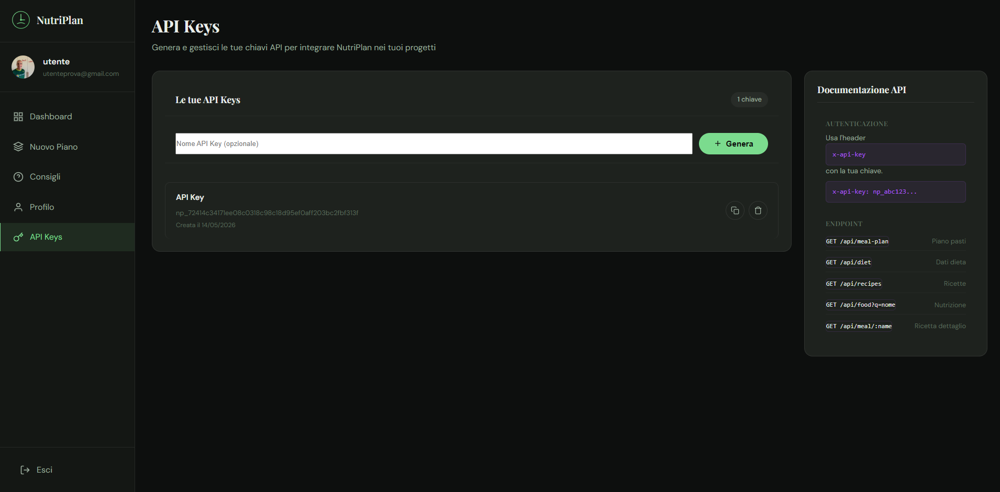
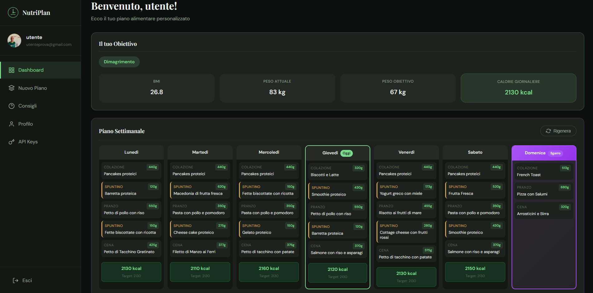

# NutriPlan

Piattaforma web per la pianificazione alimentare personalizzata. NutriPlan ti aiuta a creare un piano pasti settimanale basato sulle tue esigenze nutrizionali, con ricette italiane genuine e un'interfaccia moderna e intuitiva.

## Demo

**[nutriplan.vercel.app](https://nutri-plan-35p0101s-projects.vercel.app)**

## Screenshots

### Homepage



---

## Funzionalità

### Calcolatore BMI Integrato

Calcola immediatamente il tuo Indice di Massa Corporea direttamente dalla homepage. Il sistema analizza peso e altezza per fornirti una panoramica completa del tuo stato nutrizionale, con suggerimenti personalizzati.

### Wizard per la Dieta (3 Step)

Un processo guidato in 3 passaggi per creare il tuo piano alimentare personalizzato:

1. **Step 1 - Obiettivo**: Scegli il tuo obiettivo tra "Dimagrire" o "Massa Muscolare"
2. **Step 2 - Dati Personali**: Inserisci peso, altezza, età, sesso e livello di attività fisica
3. **Step 3 - Conferma**: Rivedi e conferma il tuo piano nutrizionale personalizzato

### Algoritmi Nutrizionali Avanzati

Il sistema utilizza formule scientifiche riconosciute:

- **BMI**: Indice di Massa Corporea
- **BMR (Mifflin-St Jeor)**: Fabbisogno energetico a riposo
- **TDEE**: Fabbisogno energetico giornaliero totale
- **Macronutrienti**: Proteine, carboidrati e grassi calcolati in base all'obiettivo

### Piano Pasti Settimanale

Generazione automatica di un piano pasti completo per 7 giorni, con:

- **Colazione**: pasti energetici per iniziare la giornata
- **Pranzo**: pasti equilibrati per il pranzo
- **Cena**: pasti leggeri ma nutrienti
- **Spuntino**: snack sani tra i pasti
- **Sgarro settimanale**: un pasto libero per non rinunciare ai piaceri

Ogni pasto include:
- Nome del piatto
- Ingredienti necessari
- Tempo di preparazione
- Difficoltà
- Istruzioni di preparazione
- Valori nutrizionali completi (calorie, proteine, carboidrati, grassi)

### Ricette Italiane Autentiche

Oltre 150 ricette della tradizione italiana pre-caricate, organizzate per categoria:

- Primi piatti (pasta, risotto, zuppe)
- Secondi piatti (carne, pesce, uova)
- Piatti unici e insalate
- Colazioni e spuntini
- Sgarri settimanali

### Ricerca Alimenti

Integrazione con Open Food Facts per cercare informazioni nutrizionali dettagliate su qualsiasi alimento. In caso di temporanea non disponibilità dell'API, il sistema utilizza un database di fallback.

### Gestione API Keys



Sezione dedicata per la gestione delle chiavi API personali, utili per:
- Accesso programmatico ai propri dati nutrizionali
- Integrazione con altre applicazioni
- Accesso pubblico alla propria dieta (con consenso)

**Piano Base**: massimo 2 API keys
**Premium**: 2€/mese per chiavi illimitate + funzionalità avanzate

### Dashboard Utente



Dashboard completa con:
- Panoramica del piano pasti settimanale
- Statistiche nutrizionali giornaliere
- Progressione verso gli obiettivi
- Possibilità di rigenerare il piano in qualsiasi momento

### Supporto Multi-Formato

I dati API sono disponibili in:
- **JSON**: formato predefinito
- **XML**: disponibile tramite parametro `?format=xml` o header `Accept: application/xml`

---

## Tech Stack

- **Backend**: Node.js + Express.js
- **Frontend**: EJS + Vanilla JavaScript
- **Database**: Supabase (PostgreSQL)
- **Autenticazione**: JWT
- **API esterne**: Open Food Facts, TheMealDB (per ricette)

---

## Quick Start

```bash
git clone https://github.com/35p0101/NutriPlan.git
cd NutriPlan
npm install
```

Crea il file `.env`:

```env
SUPABASE_URL=your-project-url
SUPABASE_ANON_KEY=your-anon-key
JWT_SECRET=your-secret-key
```

Avvia il server:

```bash
npm run dev
```

Apri `http://localhost:3000`

---

## API Pubbliche

| Endpoint | Descrizione |
|----------|-------------|
| `GET /api/recipes` | Ricette random dalla tradizione italiana |
| `GET /api/food?q=alimento` | Ricerca informazioni nutrizionali |
| `GET /api/foods-by-goal?goal=slim\|muscle` | Alimenti consigliati per obiettivo |
| `GET /api/meal/:nome` | Dettagli ricetta specifica |

## API con API Key

| Endpoint | Descrizione |
|----------|-------------|
| `GET /api/meal-plan` | Piano pasti settimanale dell'utente |
| `GET /api/diet` | Dati dieta (BMI, calorie, macronutrienti) |
| `POST /api/regenerate` | Rigenera il piano pasti |

---

## Licenza

MIT